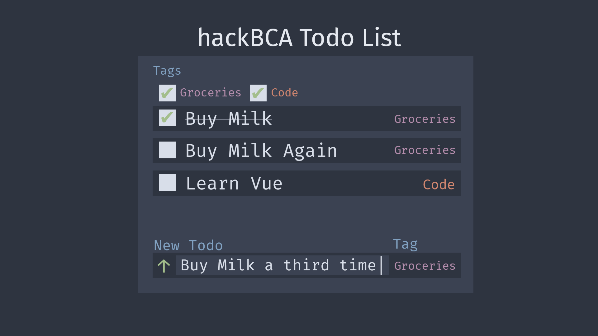
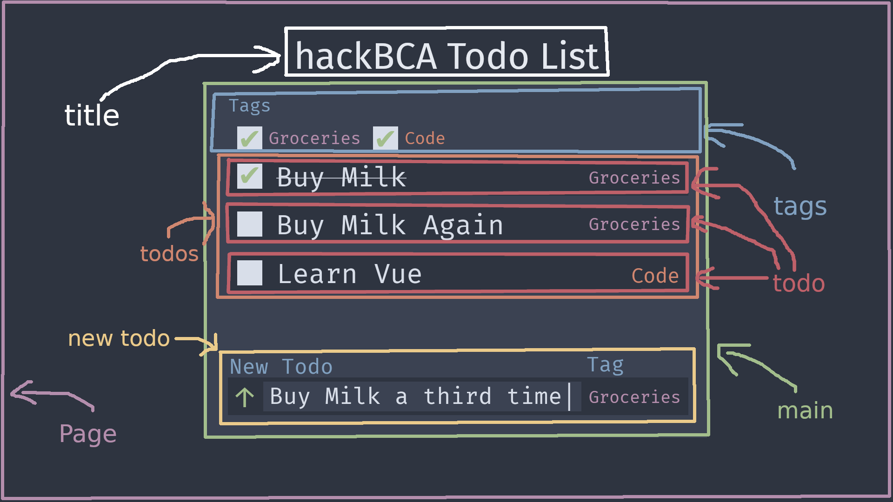
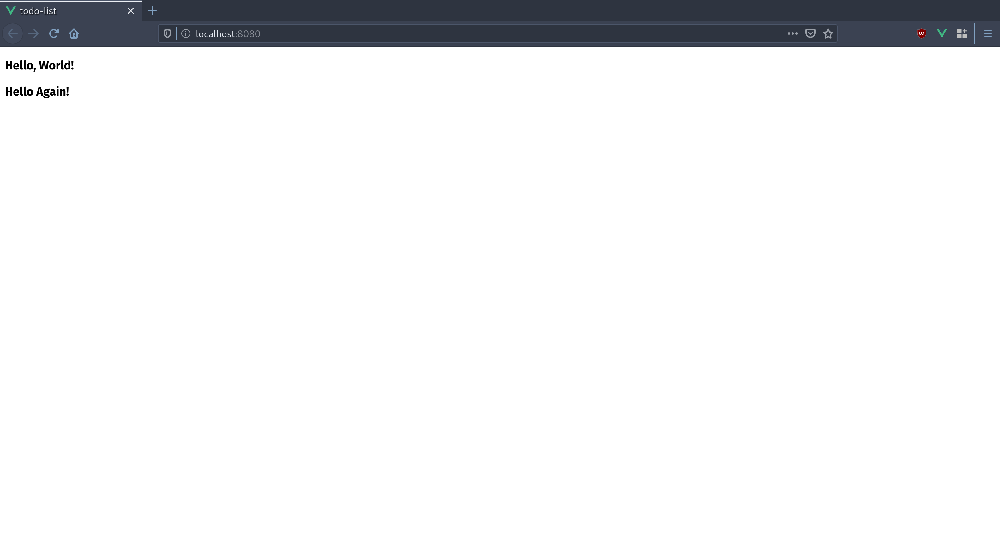

# A (briefish) intro to VueJS

hackBCA V, 2020

Aidan Glickman

[aidg.dev](http://aidg.dev)

## `Welcome`

Welcome to this VueJS tutorial. This repo is meant as a guide for the workshop I am teaching at hackBCA V, but you could probably follow along from the code examples and this document.

If you are simply looking for a jumping off point to build your own class or workshop, feel free to use my code or language, just make sure you credit me in your project :smile:.

In this tutorial, we will be learning VueJS by jumping right in and doing a project. We will be building and continuously improving a todo list application as an example.

## `$ wtf vue`

```sh
$ wtf vue
VUE: a progressive framework for building user interfaces
```

Essentially, it is a really popular javascript framework for building UIs and frontend apps.

## `requirements`

### `knowledge`


If you are taking this course, I assume you have some basic web development knowledge. Specifically, I assume you possess the following skills:

- HTML
  - Vue components essentially look like glorified HTML, so this will be crucial
- **NOT STRICTLY NECESSARY:** CSS
  - We are going to want to make our websites pretty, so you are going to want to know CSS (I will probably be using SCSS during this course, but you should be able to understand fine just knowing CSS)
- JS
  - Know the fundamentals (conditionals, data types, arrays, objects, etc.)
  - **NOT STRICTLY NECESSARY:** There will be ES6 syntax in this course, so that would be useful as well (and arrow functions)
  - **NOT STRICTLY NECESSARY:** `async/await`? Might not get to this, but it will change the way you use javascript and is a good thing to learn

### `tools`

To go through this course, you will need to have a few things installed ahead of time.

- **WINDOWS ONLY:** [git-bash](https://git-scm.com/downloads) or [WSL](https://docs.microsoft.com/en-us/windows/wsl/install-win10) if you don't want to deal with actually developing on Windows.
- [nodeJS](https://nodejs.org/en/)
  - :black_square_button: If you are on Windows then download it from the website. (You could also use something like Chocolatey if you are in to that.)
  - :apple: If you are on MacOS I highly recommend using [homebrew](https://brew.sh/) and running `brew install node`
  - :penguin: If you are on linux just install from your package manager
    - :arrow_up: Arch: `pacman -S nodejs npm`
    - :red_circle: Ubuntu: `apt install -y nodejs`
    - :fish: Gentoo: Lol you don't need my help (`emerge nodejs`)
- **OPTIONAL:** [Yarn](https://classic.yarnpkg.com/en/)
  - I just prefer `yarn` to `npm` for package management, but it isn't required. Any `yarn` commands used in this documentation can be replaced with their `npm` equivalents.
- **OPTIONAL:** It is also very helpful to have a vue extension in your text editor of choice, as you get nice features like intellisense and syntax highlighting
  - :gem: VS Code: Vue provides an extenison called [Vetur](https://github.com/vuejs/vetur) for Vue language support.
  - :heavy_check_mark: Vim: I recommend [vim-vue-plugin](https://github.com/leafOfTree/vim-vue-plugin) if you are using Vim.
  - :twisted_rightwards_arrows: Sublime Text: Vue provides a package called [Vue Syntax Highlight](https://github.com/vuejs/vue-syntax-highlight) for Vue language support.
  - :atom: Atom: Vue doesn't seem to have an official Atom package, but [language-vue](https://atom.io/packages/language-vue) has a lot of downloads.
- [Vue devtools](https://github.com/vuejs/vue-devtools)
  - Install the relevant extension for whatever browser you use
    - :radioactive: [Chrome Extension](https://chrome.google.com/webstore/detail/vuejs-devtools/nhdogjmejiglipccpnnnanhbledajbpd)
    - :fire: [Firefox Addon](https://addons.mozilla.org/en-US/firefox/addon/vue-js-devtools/)
    - If you don't use Firefox or something Chromium based, then you can also use the [standalone electron app](https://github.com/vuejs/vue-devtools/blob/dev/packages/shell-electron) (Looking at you, guy who thinks he's cool because he uses QuteBrowser)
- [VueCLI](https://cli.vuejs.org/)
  - This is the tool we will use to generate all of the boilerplate for our Vue projects
  - install with `yarn global add @vue/cli` or `npm i -g @vue/cli` if you didn't install yarn

## `intro`

### `$ diff vue {everythingelse}`

Why are we learning Vue instead of another framework like React or Angular?

1. Lower learning curve than other frameworks
1. Really fast and light
1. Increasingly popular
1. I'm better at it

### `structure`

If you have learned basic web development in the past, you may remember the "Seperation of Concerns" paradigm, where you split up your HTML, CSS, and JS in to different files. Throw that idea away. Now. :smile:

#### `components`


VueJS works on the "component" model, where instead of seperating things based on their function (layout, style, control) we seperate things in to little chunks called components, which we can often reuse.

Components have each of the three things we use in a web app within them, making them portable and easy to edit. Here is what a basic Vue component looks like:

```html
<template>
  <h1 :class="'red':activated" @click="onClick">
    Hi! I'm a Vue component called {{title}}! Click me!
  </h1>
</template>

<script>
  export default {
    name: 'Example Vue Component',
    props: { title: String },
    data: () => {
      return {
        activated: false,
      };
    },
    methods: {
      onClick: () => {
        this.activated = !this.activated;
      },
    },
  };
</script>

<style lang="scss" scoped>
  .red {
    color: red;
  }
</style>
```

Let's break down some of the things in this component so that we can get a better understanding of what's going on.

First of all, what does the `<template>` tag mean? `<template>` is actually a weird little HTML5 tag that does not display content unless it is directed to. In Vue land, `<template>` is what we put the things that we actually want to be rendered when the component is mounted. We'll get back to the weird looking fields in the H1 tag in a second.

Secondly, what is going on in the `<script>` tag? Vue components wouldn't really be all that useful without some data and functionality, so we put those in our `<script>`. First of all, we give every Vue component we create a `name` to identify it.

Next, we can pass a Vue component `props` when we create it, much like an HTML attribute. We can define what props our component takes, and what type we expect the data to be in the `props` field.

The next field in our `<script>` is `data`, which looks a little different than the others... Why is it a function? Well, `data` holds all of our state data for our component, and we need each instance of the component to have a unique set of data, so we use functions.

Finally (for this example), we have `methods`. This is simply an object holding all of the different methods we may want to call from this component. In this example, it holds the mutator that changes our `data` when the `<h1>` is clicked.

So, now we can go back to the attributes in our `<h1>`. Vue gives us a bunch of special attributes that we can use to make our app do things. All of these attributes are prefixed with a `:` if they are a way to display data, and a `@` if they call something.

Finally, we can take a quick look at our `<style>` tag. What is special about the `<style>` tag here are the two attributes that come with it. The first one, `lang`, describes what language the `<style>` content is in, so that our preprocessor knows how to interpret and compile it. The second one, `scoped`, can be included to keep our styles scoped to just the component that the style is in, and not have an effect on the rest of our app. (See what I meant when I said to forget "Seperation of Concerns"?)

For a full Vue app, we are essentially just sticking a bunch of components together with some overhead to make a complete thing.

## `plans`

Now that we understand that Vue is made up of components, let's plan out our application on a component level.

Our application will probably end up looking something like this: (Not exactly, this is just a mockup)



Now let's plan out what our components:



Now that we have a concrete plan, we are ready to jump in and start building our project!

## `vue create`

Now that we have a basic understanding of what Vue is, let's jump right in and start writing our first app!

Start by navigating to wherever you want your project to live.

```bash
cd ~/Documents # Or wherever you want to put your project
```

Then we can use VueCLI to create a project for us.

```bash
vue create todo-list
```

This command will give us a menu to guide us through all of the boilerplate that our Vue application will need. This includes configuring important tools like babel and webpack for us, so that we don't need to deal with those and can get right in to the fun stuff.

```bash
? Please pick a preset: Manually select features
? Check the features needed for your project: Babel, CSS Pre-processors, Linter
? Pick a CSS pre-processor (PostCSS, Autoprefixer and CSS Modules are supported by default): Sass/SCSS (with dart-sass)
? Pick a linter / formatter config: Prettier
? Pick additional lint features: (Press <space> to select, <a> to toggle all, <i> to invert selection)Lint on save
? Where do you prefer placing config for Babel, ESLint, etc.? In dedicated config files
? Save this as a preset for future projects? No
```

These are the settings that we will use for this project, so go through the menu and select the same options (if you would like to save it as a preset that's fine.)

Now that we have created our project, we can actually go in and run it right away! Sadly, VueCLI did not read our minds and write our whole project for us, but it did add some sample code to get us started. Let's go ahead and get our development environment up!

```bash
cd todo-list
yarn serve
```

**NOTE:** From here on out I will assume that you are in your `todo-list` directory in every command.

Now if we follow the link in our terminal output, we can see a webpage that looks something like this:


**NOTE:** This is a good time to open up your `todo-list` directory in your text editor.

Cool! Just like that we have a development environment. And the coolest thing is it will update any time we make a change to our source code!

## A bit more setup

That example page is great and all, but we don't really need it for our project. Let's go ahead and strip out the example code.

```bash
rm src/components/HelloWorld.vue
```

Then we can move over to our `src/App.vue` file, and strip it down. After deleting the styling and references to `HelloWorld`, you should end up with a barebones component that looks something like this:

```html
<template>
  <div id="app"></div>
</template>

<script>
  export default {
    name: 'App',
  };
</script>

<style lang="scss"></style>
```

## Interlude: Different programming approaches

Now that we have our web page ready, there are some decisions we have to make about our coding style. Most importantly, what order are we going to do things? We can either try to build our application from the top down - starting with the root components and working our way down to the lower level ones - or from the bottom up - essentially the opposite.


In this project I will be following a bottom up approach, so we will start with our most basic components and put them together at the end.

## `todo`

Let's get started with our simplest component, the `todo` component. This component will be a small piece that will display each one of our todos. It will then be rendered in a list so that all of our todos are shown.

Start by creating a `Todo.vue` file in `/src/components`.

```bash
touch src/components/Todo.vue
```

Now go ahead and open the `Todo.vue` file in your text editor.

We will start off extremely basic, with a component that simply displays our todos. That would look something like this:

```html
<template>
  <div class="todo-item">
    <h3>{{todo}}</h3>
  </div>
</template>

<script>
  export default {
    name: 'Todo',
    props: {
      todo: String,
    },
  };
</script>

<style lang="scss"></style>
```

With this code, we simply pass a `todo` prop to our new component and it will display it in an `<h3>`. Let's move over to our `App.vue` and give it a try.

If we want to include the `Todo` component in our `App.vue`, we need to import it just like we would any other javascript thing.

We can do that in the `<script>` section of our App.vue. We also need to create a `components` field and add it to our `App` script, then add `Todo` as a field. After doing that, your `<script>` section should look like this:

```html
<script>
  import Todo from '@/components/Todo.vue';
  export default {
    name: 'App',
    components: {
      Todo,
    },
  };
</script>
```

You may be wondering what that `@` is doing in the file path. To put it simply, you can use the `@` symbol as a standin for the root of your Vue project, so that you don't need a mess of `..`s in your code that you would need to update if you move a file.

If we now add some `<Todo>`s to our `<template>`, we can see the fruits of our labor. Go ahead and try to make some `<Todo>`s. Keep in mind that since `<Todo>` doesn't take any children, we can use it as a self closing tag, so both of the following are valid:

```html
<Todo todo="Hello, World!"></Todo> <Todo todo="Hello Again!" />
```

If we move back over to our browser, we can see that our page is updated!



Cool! We are finally rendering things to the screen! :tada:

## `todos`

now that we have the basics of our `todo` component done, let's make the `todos` component that will actually be responsible for all of our `todos`. What we want to do here is make a component that renders a list of a list of todos as `todo` components. Create a `Todos.vue` file in your `components` folder and let's get started!

```bash
touch components/Todos.vue
```

As a quick tip, there is no reason to rewrite all of our standard boilerplate every time you make a new component. Either use a text editor extension (I think all of the official extensions use the `vue` keyword to generate this template) that gives you snippets, or copy paste from another component and go from there.

Go ahead and import the `Todo` component and include it just like we did in our `App.vue` to get started. Now it's time to learn about `v-for`.

### `v-for`

[actual Vue guide](https://vuejs.org/v2/guide/list.html)

Often times on a web app, we want to render an entire list of data through a template. The way to do this without frameworks is extremely messy (writing an HTML string and adding it to the DOM). Vue provides a super easy way to do this, using the `v-for` attribute.

Here, we can make a list in our `Todos`, and then just render a list of `Todo` objects.

if we take in `todos` as a prop, then we can simlpy do something like this:

```html
<Todo v-for="todo in todos" :todo="todo" :key="todo" />
```

Let's dissect this line a bit, and discuss some potential issues.

`v-for` takes a statement in the for `"x in y"` or `"x of y"`, (doesn't matter which) which gives us an alias, `x` that represents each element of the iterable `y`. When we use a `v-for`, it is important that we also include a `:key` field, so that Vue knows how to tell the difference between the different elements and update them accordingly. Here, we are simply using the `todo` as a placeholder key, but this would be problematic if we ever have multiple todos with the same text, so we will deal with that later. You may also notice that we put a `:` infront of the `todo` prop here. This is so that Vue knows that we are not defining `todo` as the string `"todo"`, but rather the `todo` alias from our `v-for`.

Now let's update our App.vue to show our `Todos` instead of just individual `Todo`s. In the `<script>` section we can simply switch all of the mentions of `Todo` to `Todos` to import our new module. We will also want to define an array in our `data` field (remember that from the example? If not go take [another look](#components).)

```html
<script>
  import Todos from '@/components/Todos.vue';
  export default {
    name: 'App',
    components: {
      Todos,
    },
    data: () => {
      return {
        sampleTodos: ['Hello, World!', 'Hello Again!', 'yoyoyo'],
      };
    },
  };
</script>
```

Now that we have all of that set up, we can simply add a `Todos` component that renders our `sampleTodos` in our `<template>`.

```html
<Todos :todos="this.sampleTodos" />
```

Just like that, we are rendering our samples to the screen! :tada:


